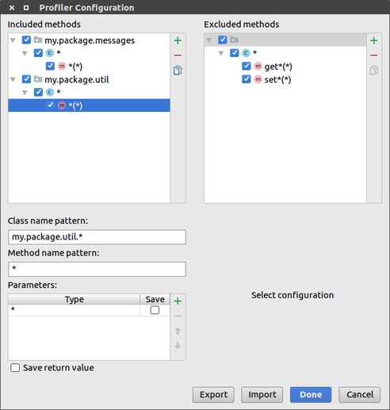
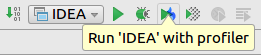
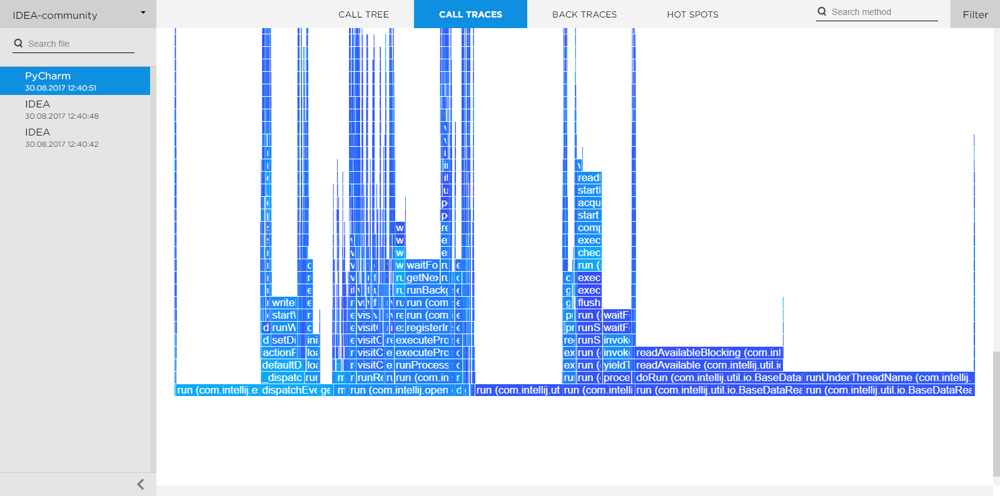
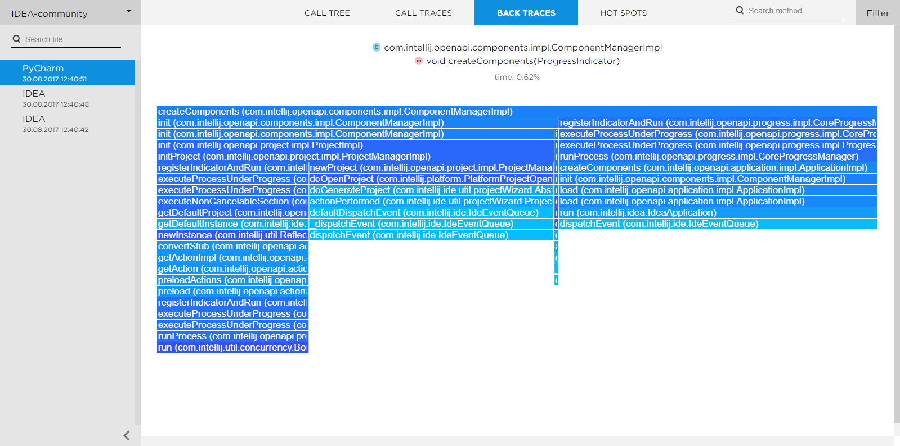
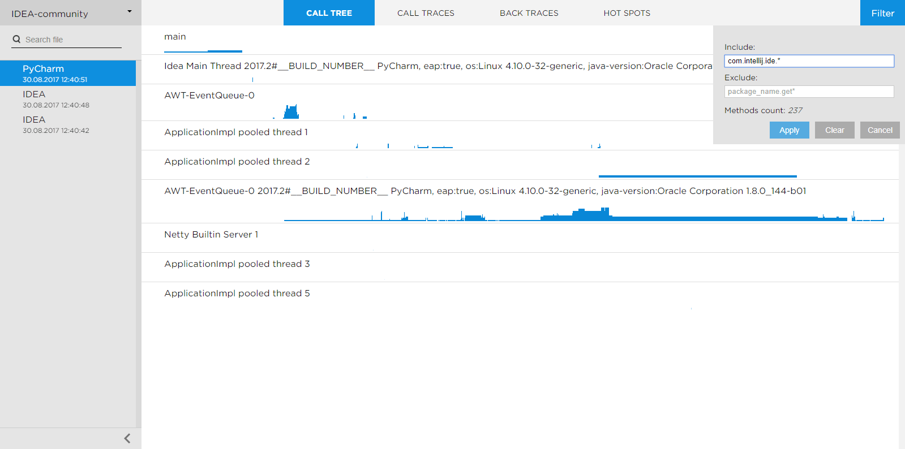
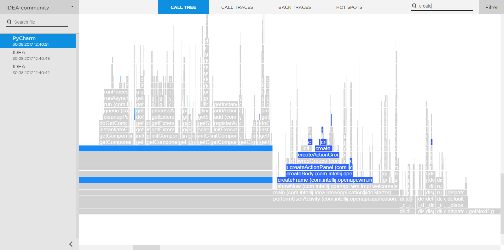
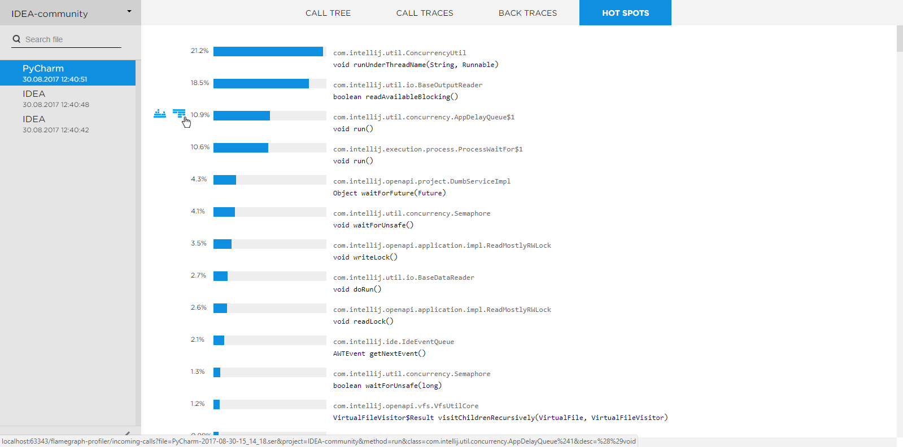
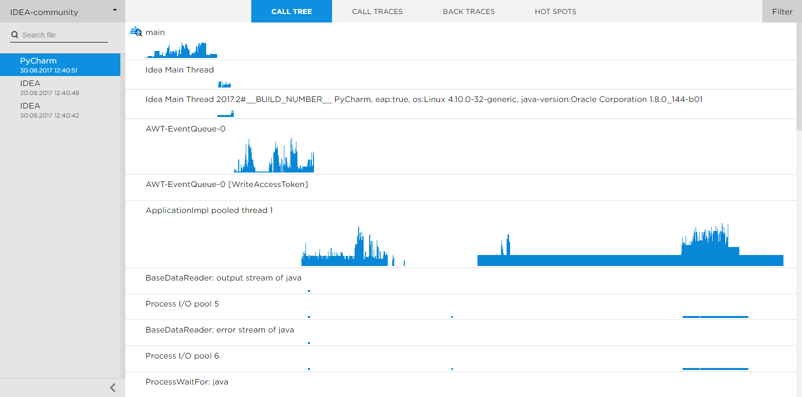
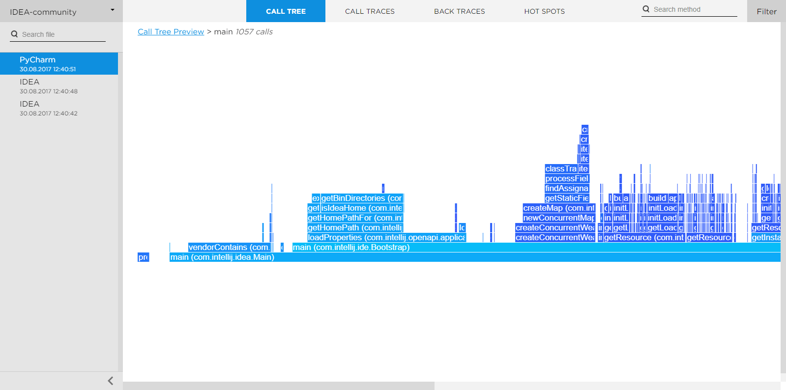

# Flamegraph Profiler
Instrumentation Java Profiler & Flamegraph Visualizer.

## Table of contents
* [Performance Recording](#performance-recording)
* [Visualizing Results](#visualizing-results)
    * How to open
* [Flamegraph Visualizer Features](#flamegraph-visualizer-features)
    * [Call Traces](#call-traces)
    * [Back Traces](#back-traces)
    * [Zoom](#zoom)    
    * [Filtering](#filtering)    
    * [Search](#search)    
    * [Hot Spots](#hot-spots)    
    * [Call Tree](#call-tree)    
    * [Detailed View of Thread](#detailed-view-of-thread)

## Performance Recording
Plugin lets you record performance of Java program with instrumentation profiler.

1. To specify methods that will be recorded open **Tools | Flamegraph Profiler | Edit Configuration...**  
The configuration below tells profiler to record all methods from my.package.util and my.package.messages packages except methods that start with 'get' or 'set'.  

2. To run program with profiler select the desired run configuration and choose **Run <name> with profiler**  

3. Also you can configure profiler to save value of method's parameters or it's return value. This should be done if you want to see how parameters influence method's performance. To enable this option check 'Save' checkbox beside type of parameter(s) when editing pattern in configuration.
4. Methods of system classes are not recorded by default. You may include them if you specify full name of a system class in configuration. For example: _java.io.FileOutputStream.*(*)_

## Visualizing Results
You can analyze performance of your program with **Flamegraph Visualizer** that is included in the plugin.  
It supports following files:
* Files in flamegraph format
* _.ser_ files that are created by Flamegraph Profiler
* _.jfr_ files created by Java Flight Recorder
* Yourkit _csv_ files. To generate csv file from a snapshot run following script:  
```bash
java -jar -Dexport.call.tree.cpu -Dexport.csv <path-to-yourkit>/lib/yjp.jar -export ~/Snapshots/<snapshot-name>.snapshot <dir-of-converted-file>
```

Ways to open visualizer:
1. After executing program with the profiler choose **Tools | Flamegraph Profiler | Open Results...** to see the result.
2. To upload your _.jfr_ or _.ser_ file choose **Tools | Flamegraph Profiler | Upload File...**

## Flamegraph Visualizer Features
Flamegraph Visualizer helps you to analyze performance of Java program. It draws a flamegraph where x-axis represents time and y-axis shows stack depth.

Each rectangle represents a method. If a rectangle is wide it means that your program spent a lot of time executing this method and methods that were called within it.

Basically you are looking for rectangles that have a wide "roof" that does not have any other method calls. It means that your program spent a lot of time executing this method.

### Call Traces
This flamegraph accumulates all stacktraces of profiled program. One rectangle represents one or multiple calls of method.

If you place the cursor on the method's rectangle you will see popup with detailed information about method.

If you click on call-traces/back-traces icon on a popup (blue icons at the top of popup) you will see call-traces/back-traces tree for the method (this tree accumulates information from all calls of the method).


### Back Traces
_Back Traces_ is the bottom-up tree. It shows methods that called the method on the top of flamegraph. This flamegraph may be helpful if you know that some method was called a lot of times and you want to know what is the reason for it.  


### Zoom  
Click on a rectangle to zoom in on it.  


### Filtering
If you want to see method that are located in some particular package you can apply filter.  


### Search
You can find any method, class or package using search.  
**Tips**:  
* Character '*' matches any sequence of characters.
* If profiler saved values of parameters, you may include them in search string. For example: _resolve(*, *IdeaPlugin.xml_


### Hot Spots
On Hot Spots page you can see where your program spent the most time.  


### Call Tree
_This page is only for _.ser_ files_  
On **Call Tree** page you can see activity of all threads. To see what was happening inside particular thread you should click on it's name.   


### Detailed View of Thread
_This page is only for _.ser_ files_  
On this page you can see what was happening inside some thread. All method calls have original order. Each rectangle represents only one method call.  
You can see popup with detailed information about method if you place the cursor on the method (also there are parameters and return value if they were saved).  



## Building
Plugin will be soon on plugins.jetbrains.com

Build jar with [Flight Recorder parser](https://github.com/kornilova-l/flight-recorder-parser-for-java-9) and place it in lib/ directory.

Generate java files from .proto files. Script is [here](protobuf/README.md)

See [js files](/visualization/README.md)

Windows:
```
gradlew :agent:agentJar && \
gradlew :agent:proxyJar && \
gradlew copyAgent && \
gradlew copyStatic && \
gradlew runIdea
```

Linux:
```bash
./gradlew :agent:agentJar && \
./gradlew :agent:proxyJar && \
./gradlew copyAgent && \
./gradlew copyStatic && \
./gradlew runIdea

```
