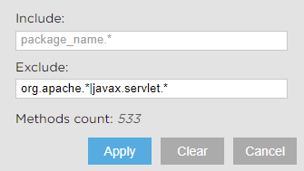

# FlameViewer

[](https://travis-ci.org/kornilova203/FlameViewer)

## Download Plugin
https://plugins.jetbrains.com/plugin/10305-flameviewer

## Table of contents
* [Uploading file to FlameViewer](#uploading-file-to-flameviewer)
* [Java performance recording. Quick start](#java-performance-recording-quick-start)
* [FlameViewer Features](#flameviewer-features)
    * [Call Traces](#call-traces)
    * [Back Traces](#back-traces)
    * [Zoom](#zoom)    
    * [Filtering](#filtering)    
    * [Search](#search)    
    * [Hot Spots](#hot-spots)    
    * [Call Tree](#call-tree)    
    * [Detailed View of Thread](#detailed-view-of-thread)
* [Contribution](#contribution)
* [Building from sources](#building-from-sources)
 
## Uploading file to FlameViewer
1. Click <strong>Tools | Open FlameViewer...</strong>
2. Upload a file of a supported profiler:
    1. _jfr_ files generated by Flight Recorder
    2. Yourkit _csv_ files. To generate csv file from a snapshot run following script: `java -jar -Dexport.call.tree.cpu -Dexport.csv /lib/yjp.jar -export ~/Snapshots/.snapshot`
    3. Files in flamegraph format
    4. _fierix_ files generated by [Fierix profiler](https://github.com/kornilova203/Fierix)
   
## Java performance recording. Quick start
Use Flight Recorder to profile your program and then open FlameViewer:
1. Make sure that you are using Oracle JDK (not OpenJDK) because Java Mission Control comes only with Oracle JDK. To do it open **File | Project Structure... | Project** then click **Edit** beside **Project SDK**, look at **JDK home path** it should be something like this: `.../jdk1.8.0_162` **not** like this: `.../java-8-openjdk-amd64`. You can download needed version from Oracle website: [JDK 8](http://www.oracle.com/technetwork/java/javase/downloads/jdk8-downloads-2133151.html), [JDK 9](http://www.oracle.com/technetwork/java/javase/downloads/jdk9-downloads-3848520.html)
2. Run JVM with following VM options: `-XX:+UnlockCommercialFeatures -XX:+FlightRecorder -XX:StartFlightRecording=duration=30s,filename=my_recording.jfr -XX:FlightRecorderOptions=stackdepth=256`
3. Open FlameViewer **Tools | Open FlameViewer...**
4. Upload my_recording.jfr

## FlameViewer Features
Flamegraph Visualizer helps you to analyze performance of Java program. It draws a flamegraph where x-axis represents time and y-axis shows stack depth.

Each rectangle represents a method. If a rectangle is wide it means that your program spent a lot of time executing this method and methods that were called within it.

Basically you are looking for rectangles that have a wide "roof" that does not have any other method calls. It means that your program spent a lot of time executing this method.

### Call Traces
This flamegraph accumulates all stacktraces of profiled program. One rectangle represents one or multiple calls of method.

If you place the cursor on the method's rectangle you will see popup with detailed information about method.

If you click on call-traces/back-traces icon on a popup (blue icons at the top of popup) you will see call-traces/back-traces tree for the method (this tree accumulates information from all calls of the method).


### Back Traces
_Back Traces_ is the bottom-up tree. It shows methods that called the method on the top of flamegraph. This flamegraph may be helpful if you know that some method was called a lot of times and you want to know what is the reason for it.  


### Zoom  
Click on a rectangle to zoom in on it.  


### Filtering
Regexp for filtering method calls e.g. `my\.package.*|another\.package.*`.  
  


### Search
You can find any method, class or package using search.

**Tips**:  
* Character '*' matches any sequence of characters.
* If profiler saved values of parameters, you may include them in search string. For example: _resolve(*, *IdeaPlugin.xml_


### Hot Spots
On Hot Spots page you can see where your program spent the most time.  


### Call Tree
_This page is only for _.ser_ files_  
On **Call Tree** page you can see activity of all threads. To see what was happening inside particular thread you should click on it's name.   


### Detailed View of Thread
_This page is only for _.ser_ files_  
On this page you can see what was happening inside some thread. All method calls have original order. Each rectangle represents only one method call.  
You can see popup with detailed information about method if you place the cursor on the method (also there are parameters and return value if they were saved).  


## Contribution
If you would like to contribute please ping me on telegram @lkornilova, there are plenty of tasks to do :)

If you have a suggestions or found a bug [open an issue]

## Building from sources
If only want to use plugin then you should simply install ready-to-use [jar](https://plugins.jetbrains.com/plugin/10305-flamegraph-profiler).

```bash
./gradlew :visualization:copyStatic
./gradlew :intellij-plugin:runIdea
```

 [open an issue]: https://github.com/kornilova203/FlameViewer/issues
